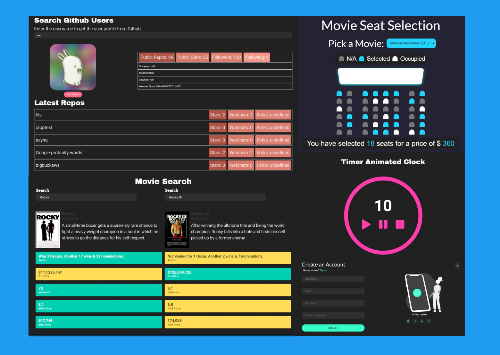
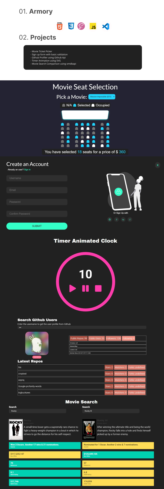

### 5-JavaScript-Projects-Part-1

<br />
<p align="center">
  <a href="https://github.com/m90khan/5-JavaScript-Projects-Part-1/">
    
  </a>

  <h3 align="center">5 JavaScript Projects Part 1  </h3>

  <p align="center">
JavaScript Projects <br />
    <a href="m90khan@gmail.com"><strong>Contact Me</strong></a>
    <br />
    <br />
    <a href="https://github.com/m90khan/5-JavaScript-Projects-Part-1/">View Demo</a>
    
   </p>
</p>

## Table of Contents

- [About the Project](#about-the-project)
- [Projects](#projects)
- [Skills](#skills)
- [Code Snipet](#code)
- [Connect with me](#Contact)

---

### About the Project

- Combination of five different projects to practice javaScript.

Live: https://github.com/m90khan/5-JavaScript-Projects-Part-1/
Layout: Flexbox (BEM Model)
Duration: 20 hrs - 4 days split



#### Projects

- Movie Ticket Picker
- Sign up form with basic validation
- Github Profiler using Github Api
- Timer Animation using SVG
- Movie Search Comparison using omdbapi



---

### Skills

[][youtube]
[][youtube]
[][youtube]
[][youtube]
[][youtube]
[][youtube]
[][youtube]
[][youtube]
[][youtube]
<br />
<br />

---

### Code Snippet

```javascript
function populateUI() {
  const selectedSeats = JSON.parse(localStorage.getItem('selectedSeats'));

  if (selectedSeats !== null && selectedSeats.length > 0) {
    seats.forEach((seat, index) => {
      if (selectedSeats.indexOf(index) > -1) {
        seat.classList.add('selected');
      }
    });
  }

  const selectedMovieIndex = localStorage.getItem('selectedMovieIndex');

  if (selectedMovieIndex !== null) {
    selectMovie.selectedIndex = selectedMovieIndex;
  }
}
```

---

### Connect with me:

[][youtube]

[][twitter]
[][linkedin]
[][instagram]
[][behance]
[][dribble]
<br />

---

[youtube]: https://www.youtube.com/channel/UC96rVfdTKsjZpREnH6CaCOw
[twitter]: https://twitter.com/m90khan
[linkedin]: https://www.linkedin.com/in/uxdkhan
[instagram]: https://www.instagram.com/uxd.khan/
[behance]: https://www.behance.net/Khan_Mohsin
[dribble]: https://dribbble.com/uxdkhan
